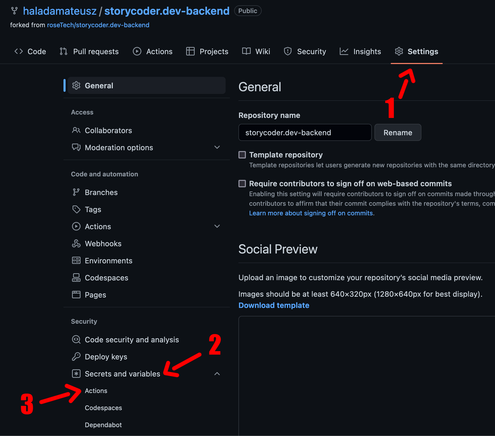
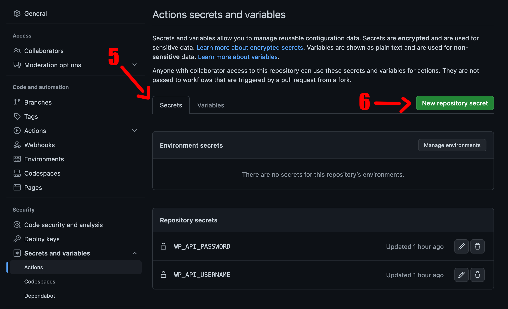
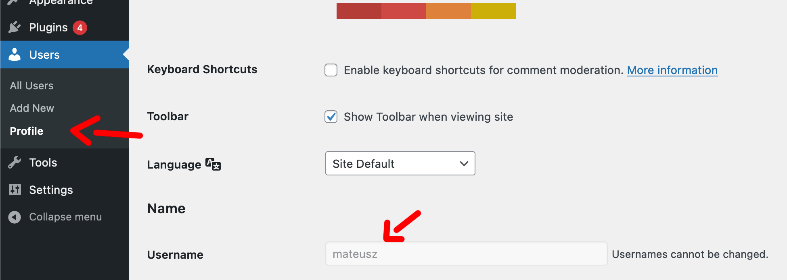
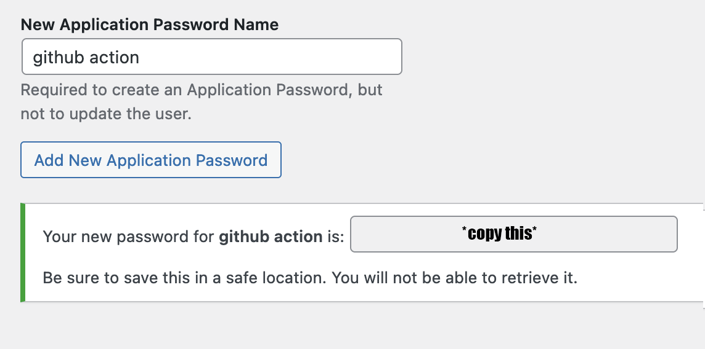
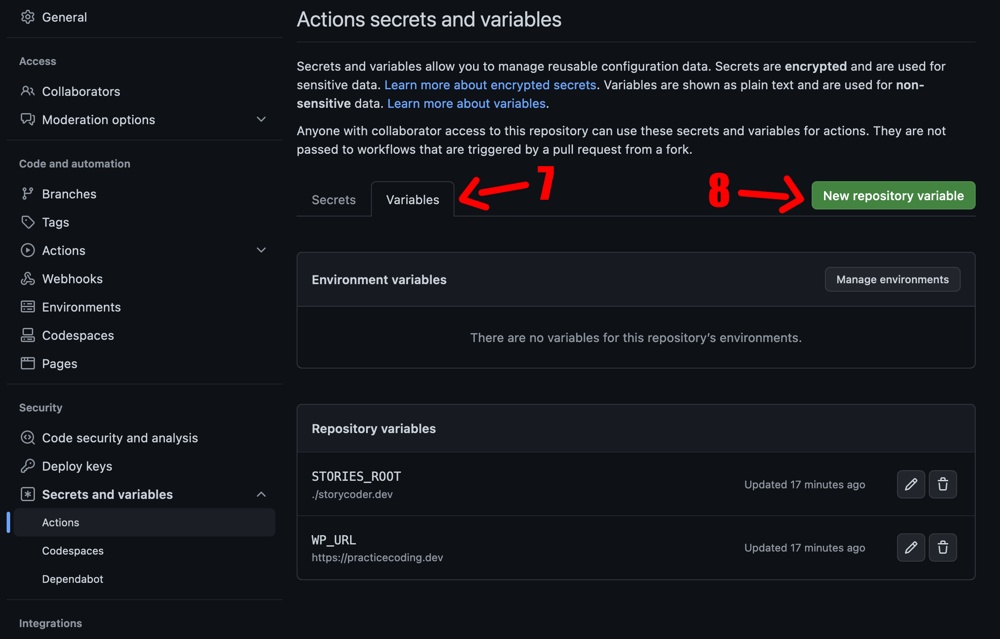
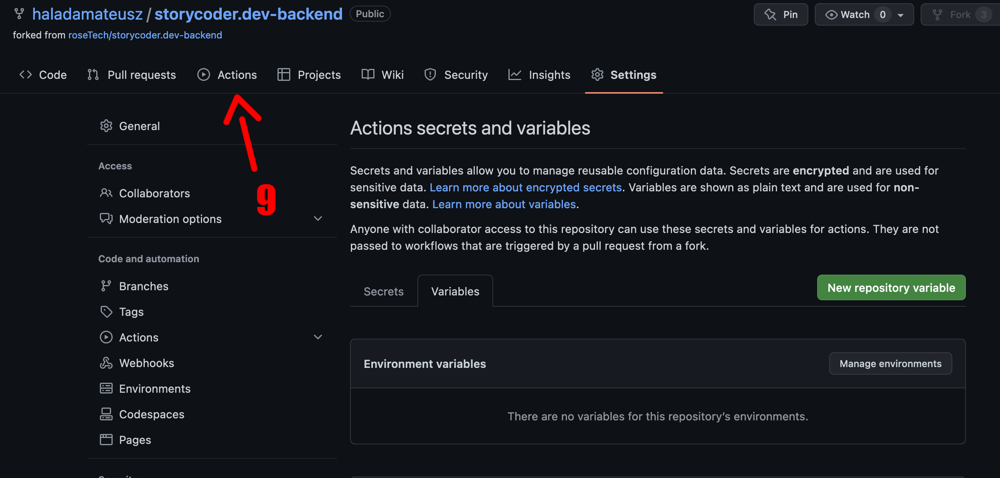
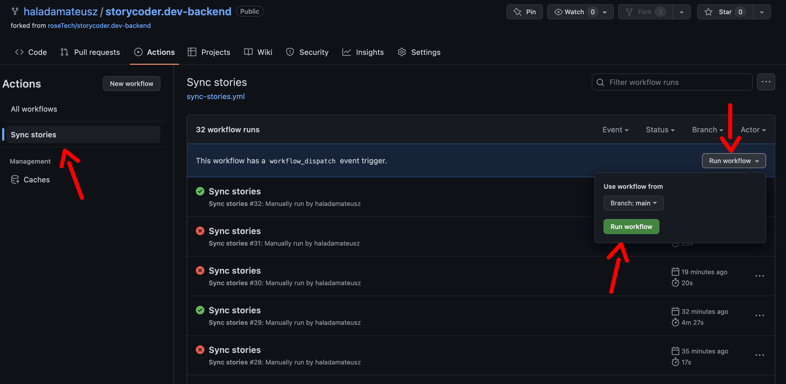

How to configure it to work properly on your repo:

Step 1) Go to settings tab in repo view

Click on "Secrets and Variables" then "Actions"



Step 2) In secrets tab, click new repository secret and add two of them:



```
key: WP_API_USERNAME
value: your username from wordpress (see screen below)
```



scroll down and generate application password.
set New Application Password Name to "Github action" and click "Add new application Password"
Copy generate value



```
key: WP_API_PASSWORD
value: your application password in parenthesis like "generated application password"
```

Step 3) navigate to variables tab. add two variables:

```
key: STORIES_ROOT 
value: ./stories-dev
```

```
key: WP_URL
value: https://practicecoding.dev or https://storycoder.dev, depends on the environment you want to update
```



Step 4) go to Actions tab



Step 5) click on "Sync stories" workflow, then "run workflow" and "run workflow" from the dropdown menu



After successful run, list of stories should be updated! :)
